# Streaming Schedule

Project by [Raluca Fritz](https://github.com/ralucafritz) for the `Advanced Front-End: React & Angular` course for `University`.  

## **Problem Statement**

The aim of the application is to offer a centralized hub for individuals to keep track of and access the upcoming streams of certain content creators. The application is equipped with a comprehensive list of streams that users can easily navigate through and discover new content.   

Users who have created an account on the platform are granted access to add new streams to the list, thereby expanding the pool of content for everyone to enjoy.   

The application also features a dedicated contact section, where users can directly voice their questions, concerns, or feedback.  

## **Technologies**

**Front-end**
- `Angular`
- `Tailwind` with `SCSS`
- `Typescript`

**Back-end**
- `Firebase`

## **Features**
1. **View Upcoming Streams:**
The application features a comprehensive list of upcoming streams that users can view and stay informed about certain individuals' schedules.
2. **Manage Streams:**
Registered users have the ability to **add**/**remove** streams to/from the list.
3. **Contact Section:**
The application includes a contact section that allows users to communicate with admins and provide feedback.

**Implementation details**
- **Auth** with *Firebase*
- **CRD** DB actions
- The code uses various Angular features such as **Components**, **Services**, **Routing**, and **Forms**.
  - **Routing:** ensures a seamless user experience and enhances the overall functionality of the application.
  - **Intercomponent communication** with `@Input()` binding, `@Output()` binding and `EventEmitter`
  - **Reusable components:** can be utilized throughout the application,reducing code duplication, improving overall code maintainability and readability, examples: `NavBarComponent`, `FooterComponent` and `AlertsComponent`
  - **Services:** 
    - **AuthService:** This service handles the authentication of the user, including signing in and signing up. It implements the basic authentication functionality such as storing and retrieving the user's credentials, and managing the authentication status.
    - **AuthGuard:** This service is responsible for protecting the routes of the application by ensuring that only authenticated users can access certain pages. It is used to enforce authentication policies and redirect users who are not authenticated to the login page.
  - **Forms** These forms are used for various purposes such as creating a new stream, sending messages to the admins and logging in and registering as a user. The forms in the repository are implemented using Angular Reactive Forms
- **Observables:** in the [AuthService](https://github.com/ralucafritz/FE-Project-Angular-Year-3/blob/main/StreamingScheduleApp/src/app/services/auth.service.ts), observables are utilized to retrieve user authentication information and to notify the rest of the application when the authentication state changes. Additionally, in the [NavBarComponent](https://github.com/ralucafritz/FE-Project-Angular-Year-3/blob/main/StreamingScheduleApp/src/app/components/nav-bar/nav-bar.component.ts), observables are employed to subscribe to the authentication state and update the navigation bar accordingly.
- **Storage Wrapper:** extension of the `localStorage` that providing the ability to listen for `localStorage` events.
- Realtime stream number indicator  
    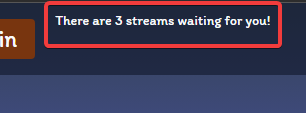
- Custom Favicon  
    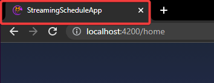

## **Course Requirements**
- multiple routes
- reusable components
- intercomponent communication
- `public` and `private` routes
- at least one form page of type `login`/`register`
- `Firebase` or anything else for back-end

## [Demo🎥](https://youtu.be/O3hlH6ay6xI) 

## Screenshots

- Home page:   
  - list of upcoming streams  
    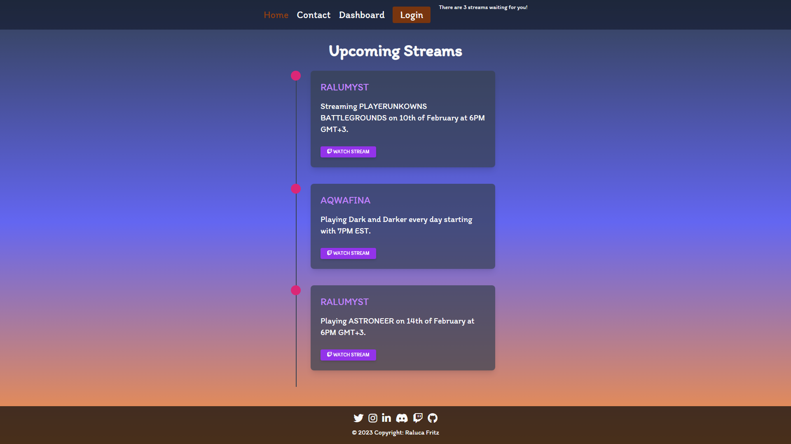 
  - supports stream deletion available only while logged in
    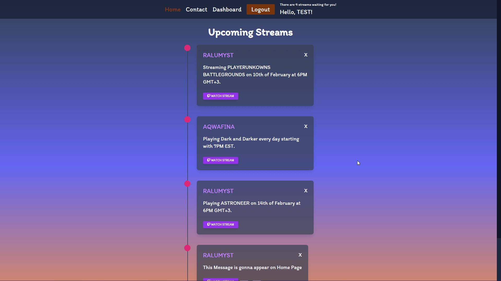
- Contact page  
    - 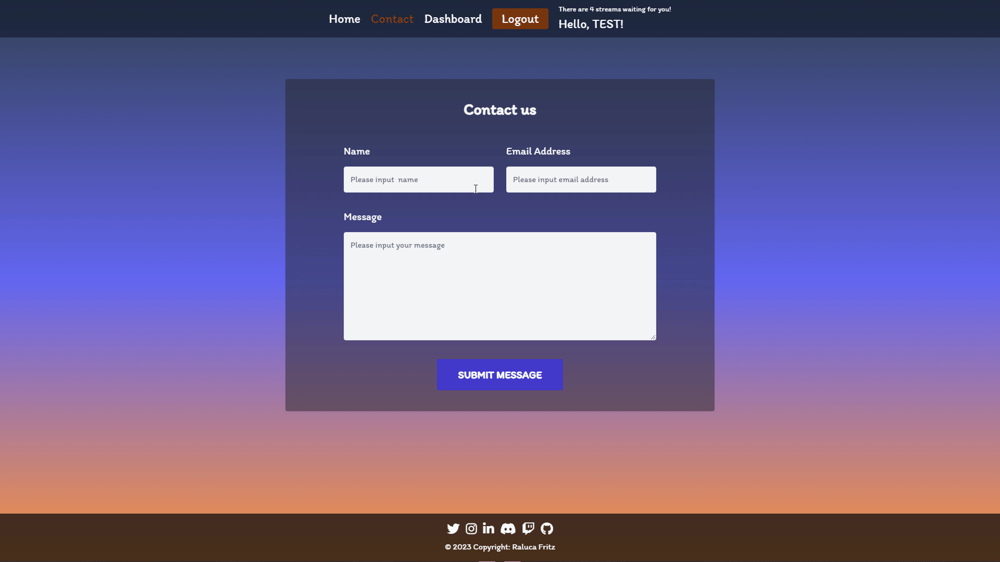
- Dashboard page  
  - navailable only while logged in
        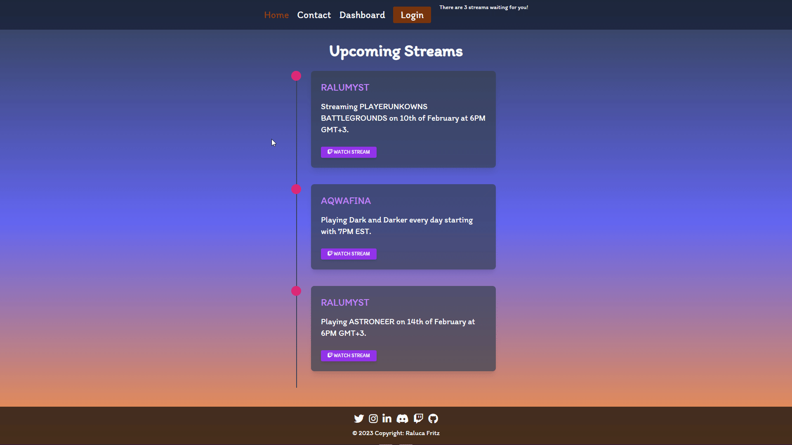
  - supports stream addition
        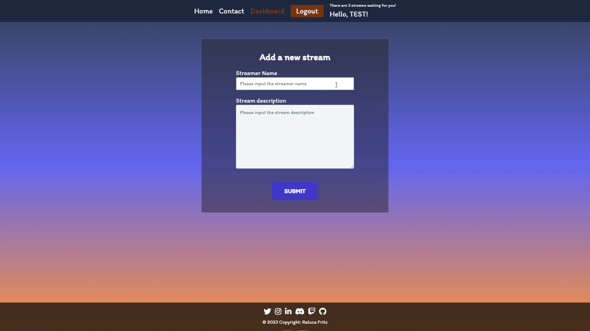
  - minimum character requirements for description alert  
        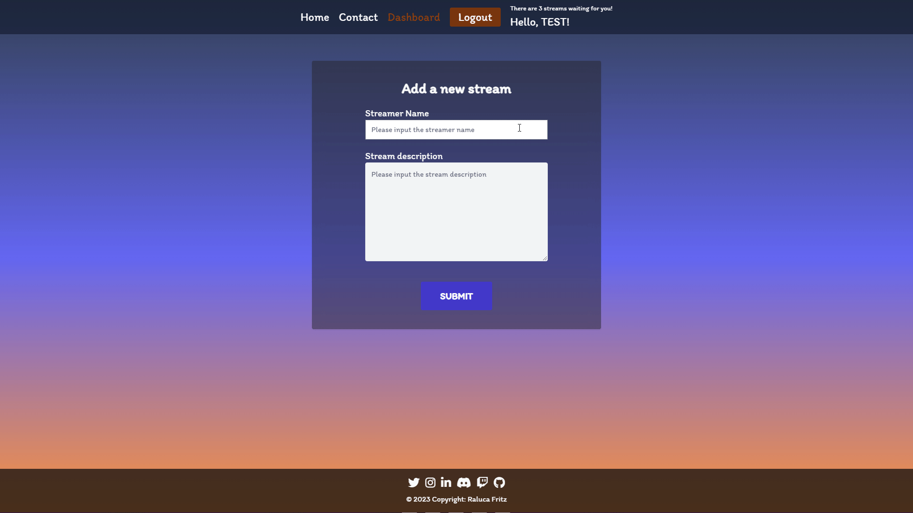
- Login page:   
  - static picture
  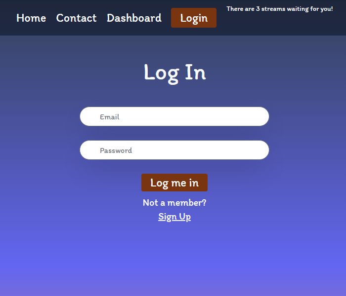
  - with custom alerts    
    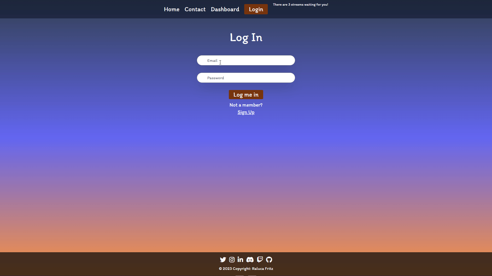
- Signup page:  
  - static picture
    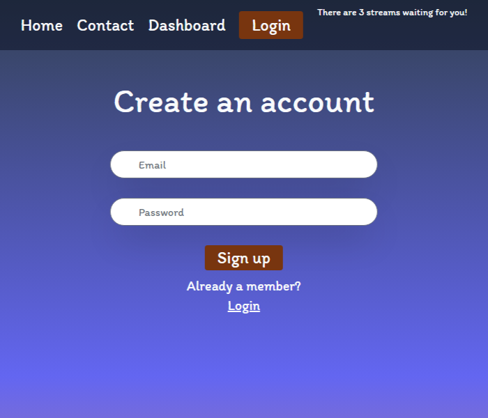
  - with custom alerts    
    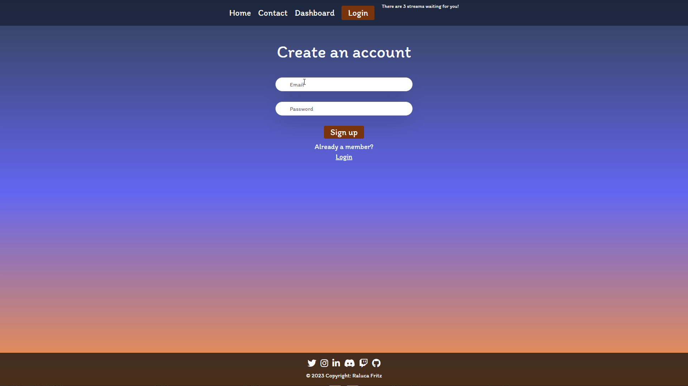
- Other:
  - customize greeting with current logged in user's name (first 4 characters of the email provided at account creation)  
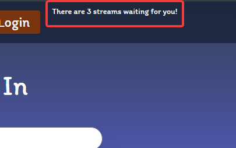</img>
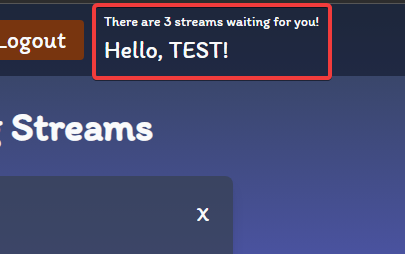</img>
  - footer  
</img>
